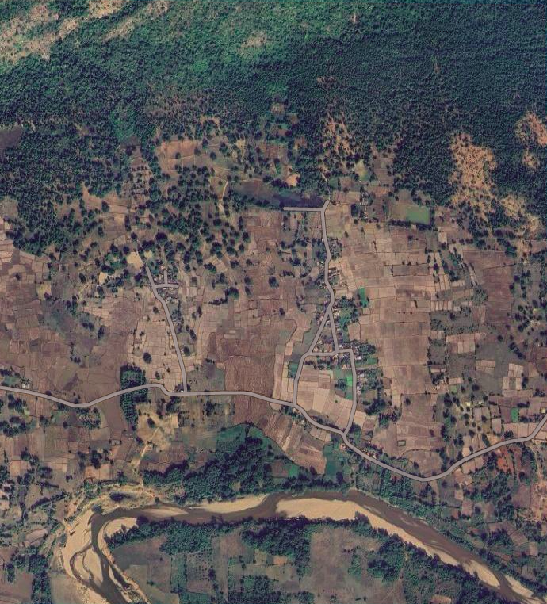
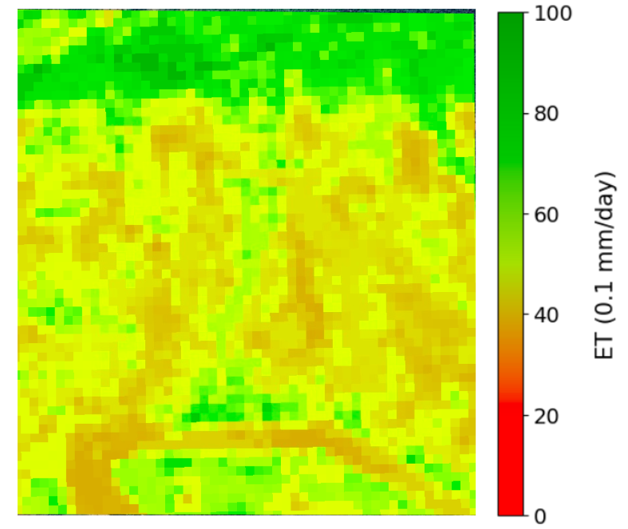
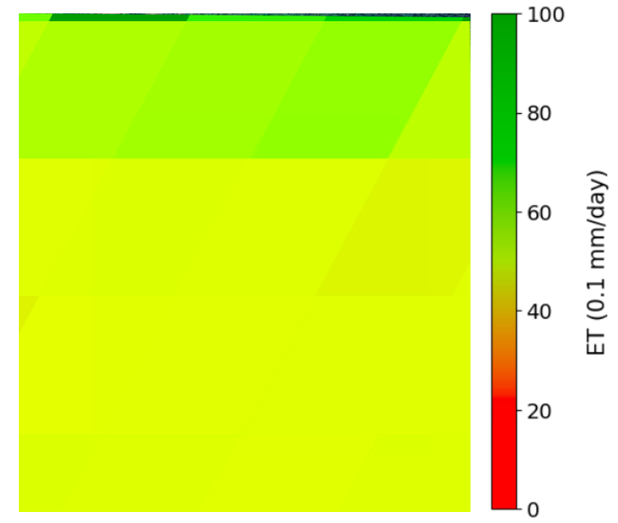

# Scalable ML-Based Approach for Downscaling ET

### Overview

The main objective of the repository is to contribute a scalable and adaptable solution to address the growing demand for fine-resolution Evapotranspiration data. The code makes the following contributions:
* Implementation of a Random Forest model that can output the downscaled ET at a scale of 30m across all regions of India in Google Earth Engine, which makes it scalable for extensive utilisation for ecological and hydrological models.
* Visualization of the downscaled ET output using GEE’s visualization tools can help in spatial and temporal analysis of trends of ET at the region of interest.

### Repository Structure

The repository is organized as follows:

```
├── scripts/  
| ├── Downscaling/              
│ |  ├── DataExtraction/   
| |  |   ├── ExportTrainingDatatoDrive.js    # It exports the input features and ET values in form of CSV file
| |  |   ├── InferenceETfromModelAsset.js    # It imports the trained model from assets and produces downscaled ET
| |  |   ├── TrainTileUploadAsset.js         # It exports the training regions (tiles) as asset
│ |  ├── ModelTraining/ 
| |  |   ├── modelTrain&Upload.ipynb         # It uses the exported training data to train the model, and uploads the trained model as an GEE asset
| ├── Calibration/ 
└── Readme.md             
```

### Training pipeline

#### Asset generation from Tile coordinates
File: TrainTileUploadAsset.js
Takes list of training are polygons as input, converts them into feature collection and exports them as Earth Engine asset.

#### Tabular dataset generation
File: ExportTrainingDatatoDrive.js

This script imports the asset, configures parameters (area, year, season), loads Landsat, MODIS, and GLDAS data, filters them by date and region, calculates spectral indices, merges climate variables, and resamples as needed. It then samples each matched image to produce training data with various bands (including indices, ET, and humidity) and finally exports the result as a CSV.

#### Training 
File: modelTrain&Upload.ipynb
Takes the dataset for 2016-21 for seasons Rabi, Kharif and Zaid as traning data and 2022 as validation data (time duration can be customised), performs Random Forest Regression to generate trained decision trees (uploads them to GEE for ET inference) and outputs different types of errors over training and validation data.


### Results 

The model outputs ET at a resolution of 30 meter, by being trained on the MODIS ET as output which is at resolution of 500 meter.



This is a snapshot of the satellite image of the region 

 

This is the downscaled ET produced by the model at scale of 30m



This is the MOD16A2 ET product for the region at scale of 500m

Research Paper: Initial Experiments with a Scalable Machine Learning Based Approach for Downscaling the MOD16A2 Evapotranspiration Product

